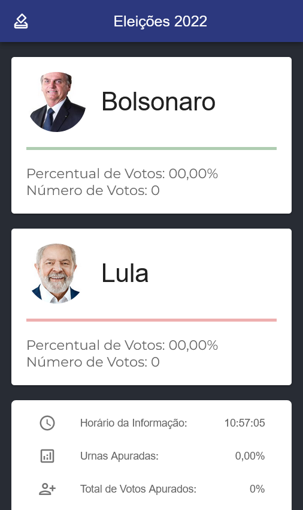

# 2022 Presidential Elections Info Page

This is the result of a challenge that I gave myself, to create a quick page to consume the [API](https://resultados.tse.jus.br/oficial/ele2022/545/dados-simplificados/br/br-c0001-e000545-r.json) results from the TSE - Superior Electoral Court in Brazil for the Second Round of the 2022 Brazilian Presidential Election, trying to expend as less time as possible to create a good looking and functional page, with Material UI. 

## Table of contents

- [Overview](#overview)
  - [The challenge](#the-challenge)
  - [Screenshot](#screenshot)
  - [Links](#links)
- [My process](#my-process)
  - [Built with](#built-with)
- [Author](#author)

## Overview

### The challenge

Users should be able to:

- View the optimal layout depending on their device's screen size
- See hover and focus states for interactive elements

### Screenshot

### Links

- Live Site URL: [Vercel]()

## My process

### Built with

- Flexbox
- Mobile-first workflow
- [React](https://reactjs.org/) - JS library
- [MUI - Material UI](https://mui.com/)

## Author

- Website - [GuillePinho](https://github.com/guillepinho)